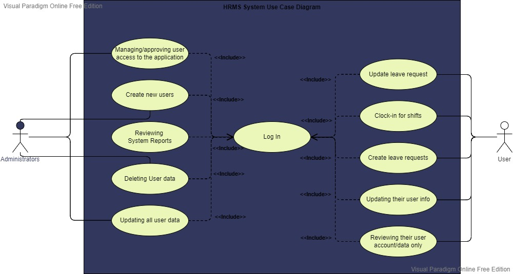

# CSE3101-Project - Group Nexus

## Project Details

**Connection Details:**

host_name = "localhost";

db_name = "hrmis";

user = "root";

password = "";

**System Title:**
	HRMIS

**Outline:**
    	Model-View-Controller Architecture of a HRMIS

**Features:**
    	Manage organizational structures: departments → units → employees
    	Employee Leave
    	Employee Attendance
    	Dashboard showing frequency of lateness and absent days
	Dashboard showing number of leave types distributed to all employees

**Use Case Diagram**

**Technology Used:**

    PHP, MySQL, HTML, CSS, SCSS, PHPMYADMIN

**Roles:**
    	Administrator, User

**Priveleges associated with Accounts:**
	Can Create, Can View, Can Update, Can Delete, Can Verify, Can Approve

**Categories of Models:**
    HR Configuration
        References
        Organization
            Company Year
            Work Location
    Shifts

    Organisation Management
        Organisation structures
        Departments
        Units
        Positions

    Employee Management
        Individuals
            Address
            National Identifiers

    Employees
            Salary
            Leave Entitlement

    Leave Management
        Leave Request
        Leave Track

    Attendance Management
        Timeclock
        Absence
        Lateness

---

## APPLICATION INSTRUCTIONS

### Setup Instructions

HRMIS is a Human Resource Management and Information System, capable of managing your employees effectively, while mainitaining a robust security mechanism that ensures that those associated with the application only see and interact with what their access allows them to.

Before getting into the application, to set up the environment conduct the following steps:

1. Extract the contents of the zip file 'CSE3101-Project-Group Nexus'
2. Inside your htdocs folder, copy the folder titled CSE3101-Project to it.
3. Ensure you have xampp control panel installed, with mysql and apache running.
4. Navigate to your 'localhost/phpmyadmin' through your web browser.
5. Create a new database titled 'hrmis'.
6. Do an 'Import'. You will import the 'hrmis.sql' file to your 'hrmis' database.
7. Once the imprt is complete, open a new tab in your browser
8. Navigate to '[localhost/CSE3101-Project/](http://localhost/CSE3101-Project/)' to get you started. This will take you to the login screen.
9. Possible logins include:
   1. username: johndoe, password: hrmisultimate (ADMIN)
   2. username: tlewis, password: Password123 (USER)
   3. username: ogrant, password: Password123 (USER)
10. The admin has full control over the entire application, except certain areas that are automatically generated but we will get into that later. For now, the user roles are 'ADMIN' and 'USER'.
11. Now you're inside the system.

### Things to note

#### Security

1. This application has very strict security and denies access based on those privileges.
2. As an ADMIN, you can create new accounts and update those accounts' information. Users cannot see their account details.
3. As an ADMIN, you have access to all modules: Configuration, Organization Management, Employee Management,  Attendance Management and Leave Management
4. As a USER, you only have access to the following modules and your privileges are mostly view only: Employee Management, Attendance Management and Leave Management
5. As a user, you can edit your individual details, national identifiers, address, and you can add timeclock entries and leave requests. Everything else is view access only.

#### Configuration

##### References

1. References allow the user to create list of values for the different fields in the application. As an example, if they wish to add a new leave type, they do so inside 'Reference'. The table name should be set to LEAVETYPES and inside value description field, they place the new leave type's name.

##### Organization

1. Organization allow you to add different organizations to the system. For the organization that is using the system, their organization type must be set to 'APP USER'.

##### Company Year

1. Create new company years

##### Work Locations

1. Define the different work locations that the organization has.

##### Shifts

1. Here, the user develops the shifts that are later attached to the employees. This would determine how their timeclock, and lateness is calculated.

#### Organization Management

##### Organization Structure

1. If the organization has varying organizational structures, they can be created here to develop the heirarchy of the organization. This acts as the header for the departments, units and positions

##### Departments

1. The first level of the organization's structure is departments.
2. Board of Directors, Directors, CEOs, etc, will act as the first level of the Organizational Strucutre. Therefore, they would not have an parent department, unless there are board of directors above the CEO.
3. Subsequent departments should all be given their respective parent departments, along with their level. Their level should always be an increment of their parent department's level.

##### Units

1. Units fall under the departments. They are derived from their departments.
2. Should ensure that their level is kept as an increment of their parent department's level.

##### Positions

1. Positions can be placed at any level of the organizational structure. This means that a position can be attached to the department titled 'CEO', at the department level and at the unit level.

#### Individuals and Employees

1. In order to create an Employee, they must first exist in the system as an Individual.
2. No one individual is made an employee twice, unless they have been separated from rehired.

#### Lateness and Absence

1. Lateness is automatically calculated for employees based on their first time-in for the day.
2. Absence is manually entered into the system by the ADMIN.

#### Leave Entitlement and Leave Track

1. Leave Track allows you to keep track of how much leave you have and how much is remaining, as well as the amount used. A record of an employee's leave track is created when a "Leave Entitlement" is attached to that employee. What this mean is, as an example, if an 'Annual Leave' is attached to an employee, the leave track record is created for that employee with the leave type of 'Annual Leave'. An employee cannot have duplicate Leave Track records for the same leave type.
2. Leave Track can only be edited by the ADMIN. They are able to change the employee's leave used, as well as leave earned.
3. An employee cannot have duplicate leave entitlements with null end dates.

## We hope that you will come to enjoy the experience this application offers. Thank you
